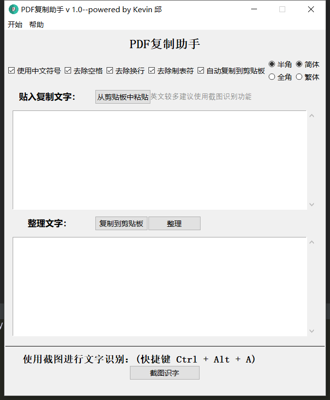

# PDF_copy_assis
自己在写论文时Ctrl C + Ctrl V  PDF 的内容出来格式各种问题，写了点代码来解决问题，顺便封装个GUI
当然，别计较bug一堆，代码丑陋，能用就行

# 功能
1. 中文复制整理
2. 截图翻译
3. 英文连词分割（正在开发中，version 1.0中没有）

# 更新记录
> v 1.1
1. 代码重构，质量优化
2. 提供选项：
    1. 中文标点
    2. 去除空格
    3. 去除换行
    4. 去除制表符
    5. 自动复制到剪贴板
    6. 全角/半角选择
    7. 简体/繁体选择
3. 增加菜单栏
    1. 设置
    2. 关于

> v 1.2
1. 布局优化
2. 增加剪贴板快速操作

> v 1.3
1. 中文符号替换优化
2. bug修复
3. 提供更新服务
4. 增加快捷键截图识别
5. 增加上下文词法分析自动合并(后面将加入设置中可选)

> v 1.4
1. 增加广播
2. 改进快捷键截图功能
3. 提供反馈功能
4. 部分bug修复
5. 增加QQ截图工具使用（通过破解DLL文件使用，一切版权归腾讯所有）

# 欢迎讨论
邮箱：qiubinyang98@163.com
